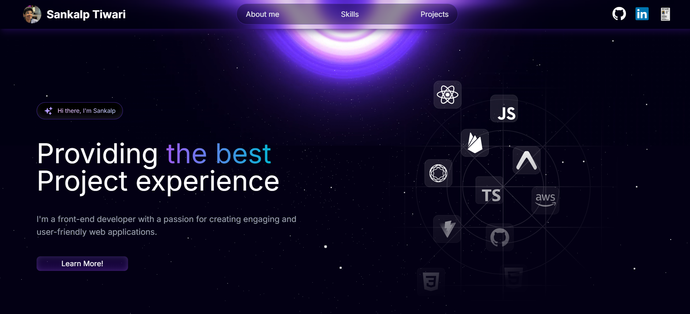

# Sankalp Tiwari

## Overview
Welcome to My Portfolio – a sleek, visually immersive developer portfolio crafted for the modern frontend enthusiast. Designed with aesthetic flair and technical precision, SpacePortfolio is your personal cosmic showcase, helping you stand out with stellar design and interactivity.

Built using cutting-edge technologies like Next.js, Tailwind CSS, Framer Motion, and React libraries, this project highlights your projects, skills, and personal story in a responsive and visually engaging format.

From animated backgrounds to modular component architecture, this template provides a professional space-themed experience to make your online presence unforgettable.
## 🎨 Preview


## 🚀 Features
✅ Hero Section with Dynamic Background 🌌
Eye-catching starry background with animated hero text and call-to-action.

✅ Responsive Navbar 🛰️
Sticky, responsive navbar with smooth scrolling and section highlights.

✅ About Me 👨‍🚀
Concise and animated introduction about you and your background.

✅ Projects Showcase 🚀
Modular project cards with animations and interactive hover effects.

✅ Skills Display 🛠️
Skill bubbles with subtle entrance animations and clear categories.

✅ Footer Section 📫
Contact and social links housed in a clean, minimal footer.

✅ Fully Modular Components 🧱
All sections built with reusable and maintainable React components.

✅ Framer Motion Animations ✨
Smooth transitions and entrance animations to elevate the visual experience.

✅ Responsive Design 📱
Seamless across all devices – mobile, tablet, and desktop.

## 🖥️ Live Demo
Check out the live version of my site here: [Live Site](https://developersankalp.vercel.app/)

---

## 🤸 Quick Start

Follow these steps to set up the project locally on your machine.

**Prerequisites**

Make sure you have the following installed on your machine:

- [Git](https://git-scm.com/)
- [Node.js](https://nodejs.org/en)
- [npm](https://www.npmjs.com/) (Node Package Manager)

**Cloning the Repository**

```bash
git clone https://github.com/Sankalp20Tiwari/spaceportfolio.git
cd spaceportfolio
```

**Installation**

Install the project dependencies using npm:

```bash
npm install
```

**Running the Project**

```bash
npm run dev
```

Open [http://localhost:3000](http://localhost:3000) in your browser to view the project.


---

## ⚙️ Tech Stack
- Next.js – React framework for SSR and static sites

- React.js – Core frontend library

- Tailwind CSS – Utility-first styling framework

- Framer Motion – Declarative animation library

- Lucide React – Icon set

- Heroicons & React Icons – Additional icon packs
---

## 📂 Project Structure
```
/spaceportfolio
├── app/
│   ├── layout.tsx          # Root layout
│   ├── page.tsx            # Main page
│   ├── globals.css         # Global styles
│   └── favicon.ico         # Site icon
├── components/
│   ├── main/               # Main sections (Hero, AboutMe, Projects, etc.)
│   └── sub/                # Sub-components (ProjectCard, SkillText, etc.)
├── constants/              # Static content for skills, projects, etc.
├── utils/                  # Utility files (e.g., Framer Motion configs)
├── public/                 # Static assets (images, icons, etc.)
├── tailwind.config.ts      # Tailwind CSS config
├── package.json            # Project manifest
└── tsconfig.json           # TypeScript configuration
```

---

## 🤝 Contributing
We welcome contributions! To contribute:
1. **Fork** the repository
2. **Create a new branch** (`git checkout -b feature-name`)
3. **Commit your changes** (`git commit -m 'Add feature'`)
4. **Push to your branch** (`git push origin feature-name`)
5. Create a **Pull Request** 🚀

---


